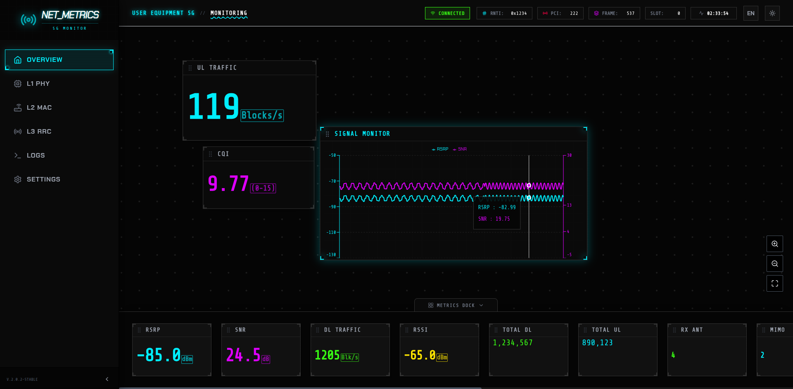
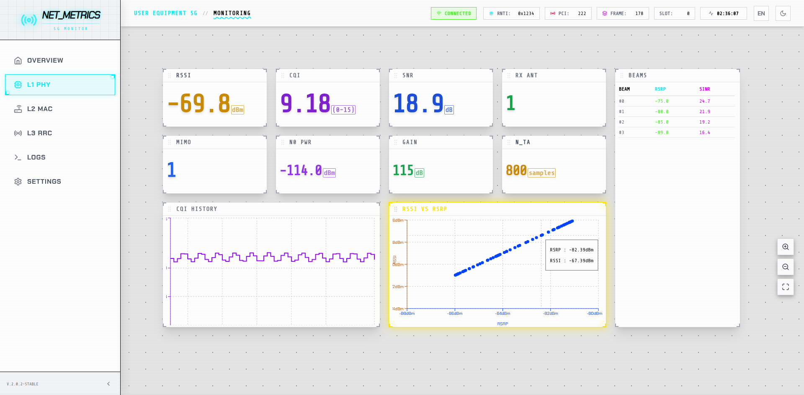

# UE Metrics Visualizer 5G
This is a 5G UE metrics visualization Web App.

## Run Locally

**Prerequisites:**  Node.js

1. Install dependencies:
   `npm install`
2. Run the app:
   `npm run dev`

## Some screenshots

